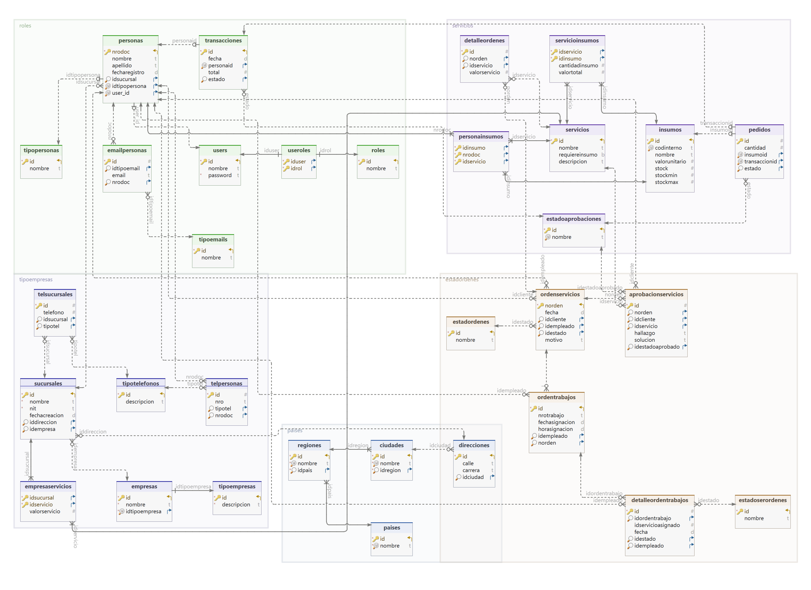

# APLICACIÓN DE SERVICIOS

 

<a href="https://www.figma.com/design/3IObRJlF4IMLLkaVNj0cp4/Services?node-id=0-1&t=6znX5AVM0F3Xyb17-1" style="display: inline-block; padding: 10px 15px; background-color: #007BFF; color: white; text-decoration: none; border-radius: 10px; font-weight 900; transition: background-color 0.3s;">
    Ir al diseño
</a>

## FRONT

## BACK

Se uso el lenguaje de `Java` con el framework `Spring Boot` para realizar la programacion de la logica de usuario, con la ayuda de JPA, Hibernate y las mutliples librerias se llevo a cabo el proyecto.  
El Aplicativo cuenta con un sistema de excepciones robusto que permite la seguridad de la información y un buen manejo de los errores en ejecución. Cuanto con un sistema de JWT que peremite la autenticacion y registro de usuarios de una manera segura.

### Funciones
  - Sistema de seguridad con JWT.
  - Multiples roles de usuario.
  
  - Servicios:
    - 

## DATABASE

Se uso el gestor de bases de datos `MySQL` junto a la herramienta `DBeaver` para realizar el esquema y análisis de la base de datos correspondiente.

### Diagrama

###

###

## TECNOLOGÍAS USADAS

  

## HERRAMIENTAS USADAS

  

## COLABORADORES

#### Elizabeth Perez Valderrama.

 

  
  
  

#### Jose David Martínez Rincón.

 

  
  
  

